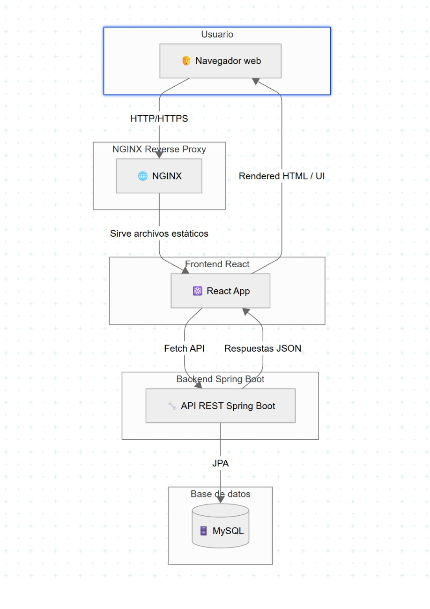
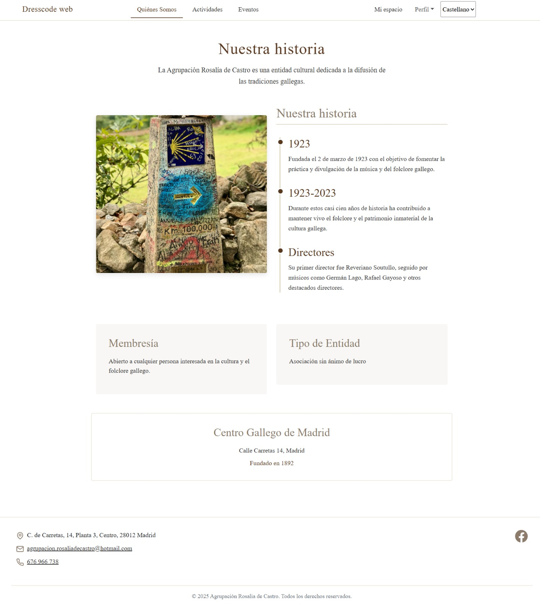
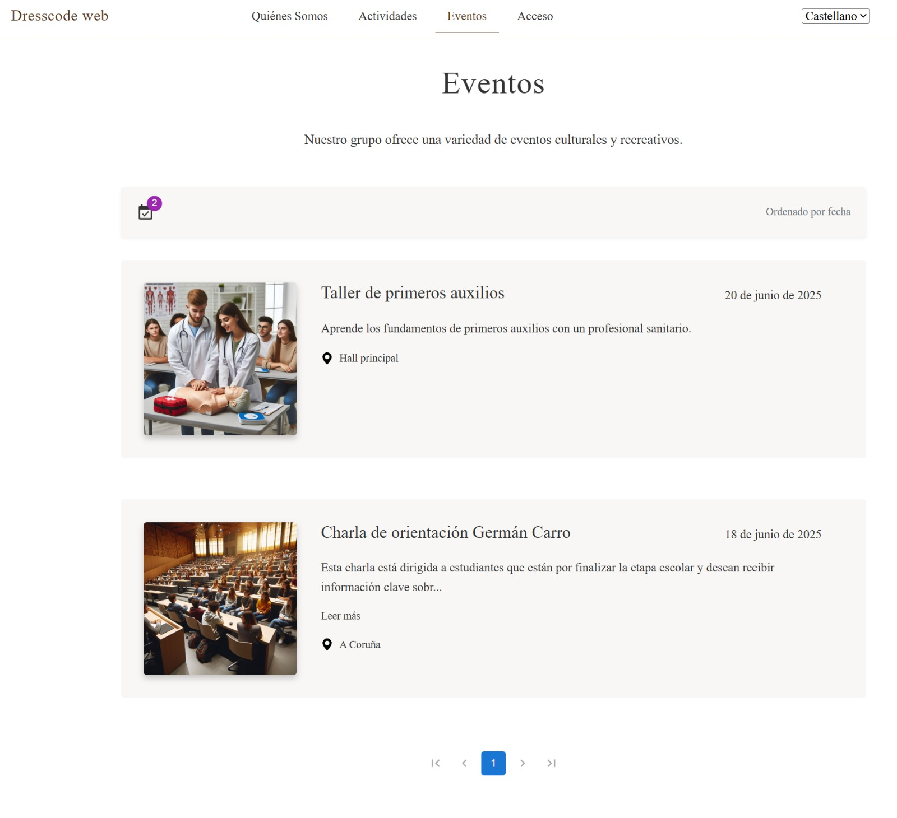
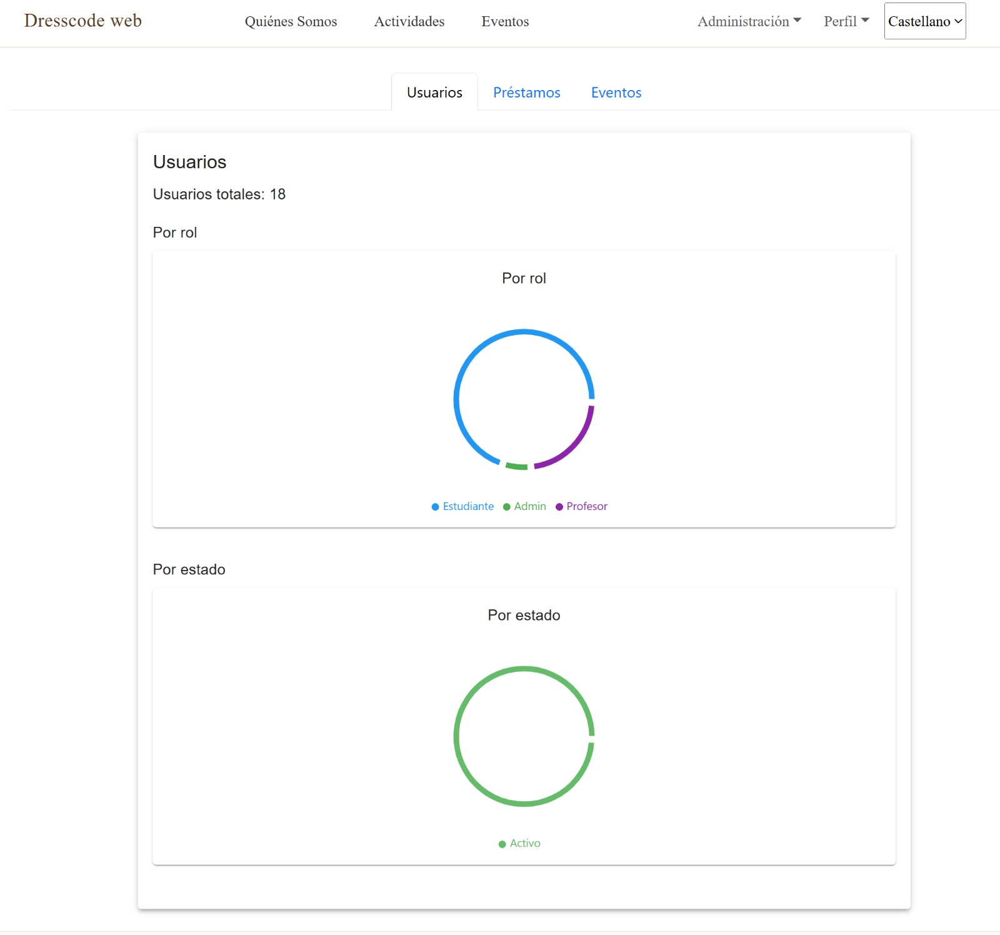
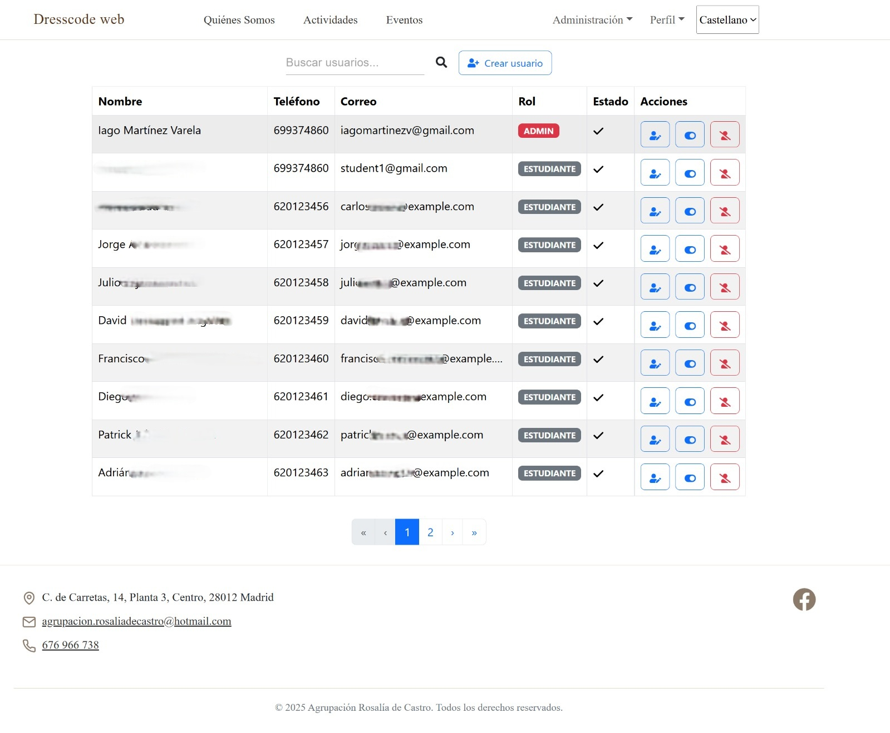

<h1 align="center">🎼 Dresscode 🎭</h1>
<p align="center">
  <strong>Comprehensive wardrobe, user, and event management for cultural music groups.</strong><br />
  <i>A full-stack web application built with React and Spring Boot. Featuring internationalization, modern UI design, intuitive admin tools, and role-based access control.</i>
</p>

<p align="center">
  
</p>

---

## 📚 Table of Contents

- [✨ Features](#-features)
- [🧱 Architecture](#-architecture)
- [🛠️ Tech Stack](#-tech-stack)
- [🚀 Getting Started](#-getting-started)
  - [⚙️ Prerequisites](#️-prerequisites)
  - [📦 Installation & Usage](#installation--usage)
- [📸 Screenshots](#-screenshots)
- [📂 Project Structure](#-project-structure)
- [🧪 Testing](#-testing)
- [🔐 Security](#-security)
- [📈 Future Improvements](#-future-improvements)
- [🙏 Acknowledgements](#-acknowledgements)

---

## ✨ Features

- 🔐 **JWT Authentication** with `ADMIN` and `USER` roles
- 🌍 **Internationalization (i18n)**: Spanish & Galician with scalable language support
- 📅 **Event Management**: Create, edit, delete, and view event details
- 🧥 **Wardrobe System**: Stock tracking, loan requests, and inventory management
- 📊 **Admin Dashboard**: Overview stats, table views, and filtering options
- 🪄 **Modern UI**: Accessible design with traditional Galician cultural influence
- 📂 **Image Upload** and display for events and garments
- 📝 **.json-based configuration** for non-technical users
- 📉 **Statistics Dashboard** _(Work In Progress)_

---

## 🧱 Architecture

The system uses a containerized microservice architecture orchestrated with Docker:

<p align="center">
  
</p>

---

## 🛠️ Tech Stack

| **Layer**  | **Technology**                                                    |
| ---------- | ----------------------------------------------------------------- |
| Frontend   | React, TypeScript, Formik, Yup, React Router, i18next             |
| Backend    | Java 17, Spring Boot, Spring Security, Spring Data JPA, MapStruct |
| Database   | MySQL                                                             |
| Deployment | Docker, Docker Compose, NGINX                                     |
| Testing    | JUnit 5, Mockito, React Testing Library                           |

---

## 🚀 Getting Started

### ✅ Prerequisites

Make sure you have the following tools installed on your machine:

- 🧩 **Java 17+**
- 🌐 **Node.js 16+**
- 🐳 **Docker** & **Docker Compose**
- 🔧 **Git**

---

### ⚙️ Installation & Usage

```bash
# 1. Clone the repository
git clone https://github.com/Iagomv/dresscode.git

cd dresscode


# 2. Build and start all services
docker compose up --build


## 📸 Screenshots

A quick visual tour of the application’s main pages and features:

---

### 🎯 Landing Page



---

### 📆 Events Page



---

### 🛠️ Admin Dashboard



---

### 👤 Admin Management



---

### 🧥 User Clothing Search


## 📦 Project Structure

## 🔐 Security

Security is implemented using **Spring Security** and **JWT**:

- 🔐 **Stateless Authentication** with tokens.
- 👥 **Role-based Access Control** (`ADMIN`, `USER`).
- 🔒 **Route Restrictions**:
  - `/admin/**` for admin users only.
  - `/user/**` for authenticated standard users.
- 🧠 **Token Validation Middleware** on both backend and frontend to protect sensitive routes.

---
## 📈 Future Improvements

The following features are under consideration or planned for future releases:

- ✅ **CI/CD Pipeline** using GitHub Actions for:
  - Automated tests
  - Docker builds
  - Deployments
- ✅ **Docker Registry Integration** for auto-publishing Docker images.
- 🚀 **Kubernetes Migration** using Helm for better scalability and orchestration.
- 🌠 **UI Enhancements** using `Three.js` or `Framer Motion` for animations and better engagement.
- 🎥 **Media Gallery**: Integrate photo & video archives from past events.
- 📬 **Email Notifications** for event reminders, loan status, etc.
- 💬 **Real-Time Chat** using WebSockets or Firebase for internal communication.

---

🙌 Acknowledgements
This project was developed as part of an academic assignment, aimed at solving real-world problems for a cultural music group.

```
