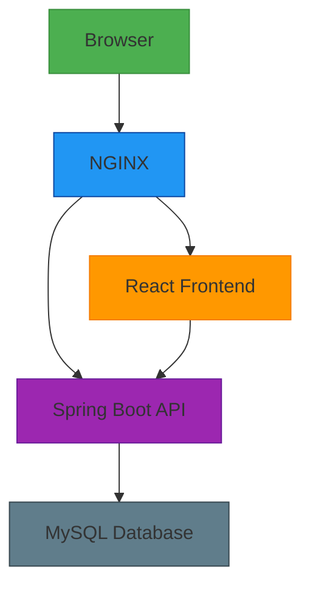
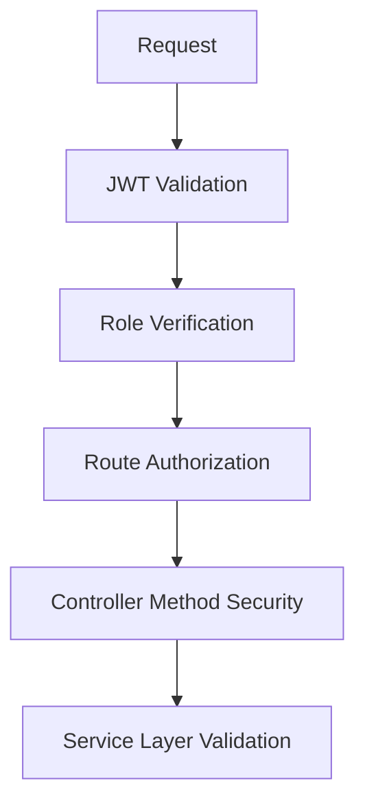
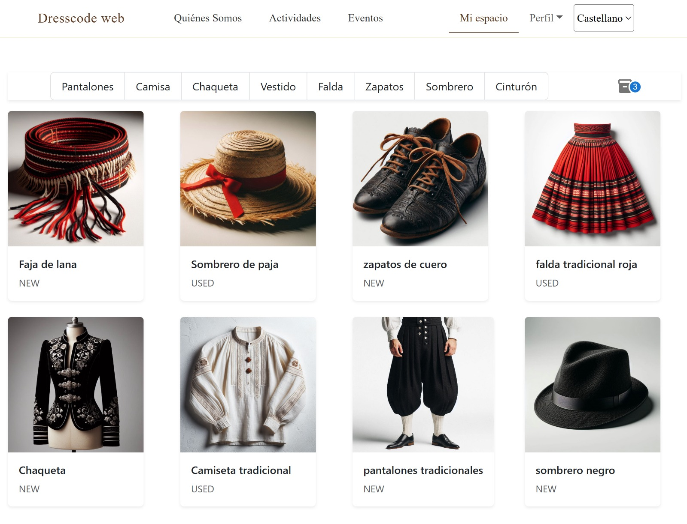

<h1 align="center">
  
</h1>

<h3 align="center">Revolutionizing Cultural Wardrobe Management</h3>

<p align="center">
  
  
  
  
</p>

<p align="center">
  <strong>✨ Comprehensive wardrobe, user, and event management for cultural music groups ✨</strong>
</p>

<p align="center">
  <a href="#-the-story-behind-dresscode" style="text-decoration:none; margin:0 8px;">🌟 Story Behind Dresscode</a> •
  <a href="#-features" style="text-decoration:none; margin:0 8px;">✨ Features</a> •
  <a href="#-architecture" style="text-decoration:none; margin:0 8px;">🧱 Architecture</a> •
  <a href="#-tech-stack" style="text-decoration:none; margin:0 8px;">🛠️ Tech Stack</a> •
  <a href="#-getting-started" style="text-decoration:none; margin:0 8px;">🚀 Getting Started</a> •
  <a href="#-project-architecture" style="text-decoration:none; margin:0 8px;">🏗️ Project Structure</a> •
  <a href="#-security-architecture" style="text-decoration:none; margin:0 8px;">🔒 Security</a> •
  <a href="#-planned-enhancements" style="text-decoration:none; margin:0 8px;">🚀 Future Improvements</a> •
  <a href="#-screenshots" style="text-decoration:none; margin:0 8px;">📸 Screenshots</a> •
  <a href="#-acknowledgements" style="text-decoration:none; margin:0 8px;">🙌 Acknowledgements</a>
</p>


## 🌟 The Story Behind Dresscode

Born from a personal need to support a friend's cultural music group and an educational project.

### ✨ What's Dresscode

<table>
  <tr>
    <td align="center" width="20%">🎭</td>
    <td><b>Real-World Solution</b><br>Born from actual struggles managing hundreds of costumes for a friend's troupe</td>
  </tr>
  <tr>
    <td align="center">🌍</td>
    <td><b>Cultural Sensitivity</b><br>Built with native Spanish & Galician support to honor local traditions</td>
  </tr>
  <tr>
    <td align="center">🤝</td>
    <td><b>Personal Origins</b><br>Initially created to solve specific pain points for a friend's musical group</td>
  </tr>
  <tr>
    <td align="center">📅</td>
    <td><b>Event Coordination</b><br>Proven to handle complex event and costume logistics</td>
  </tr>
</table>

<p align="center">
  <em>From a friend's need to a community solution</em> ❤️
</p>

## 🧱 Architecture

The system uses a **containerized microservice architecture** orchestrated with Docker, ensuring scalability and easy deployment.



---

## 🛠️ Tech Stack

| **Layer**  | **Technology**                                                    |
| ---------- | ----------------------------------------------------------------- |
| Frontend   | React, TypeScript, Formik, Yup, React Router, i18next             |
| Backend    | Java 17, Spring Boot, Spring Security, Spring Data JPA, MapStruct |
| Database   | MySQL                                                             |
| Deployment | Docker, Docker Compose, NGINX                                     |
| Testing    | JUnit 5, Mockito, React Testing Library                           |

---

## 🚀 Getting Started

### ✅ Prerequisites

Make sure you have the following tools installed on your machine:

- 🧩 **Java 17+**
- 🌐 **Node.js 16+**
- 🐳 **Docker** & **Docker Compose**
- 🔧 **Git**

---

### ⚙️ Installation & Usage

```bash
# 1. Clone the repository
git clone https://github.com/Iagomv/dresscode.git

cd dresscode


# 2. Build and start all services
docker compose up --build
```


## 🏗️ Project Architecture

### 🖥️ Backend Structure (Spring Boot)

```text
backend/
├── src/
│   ├── main/
│   │   ├── java/com/dresscode/
│   │   │   ├── controller/       🚪 # REST endpoints
│   │   │   ├── service/          ⚙️ # Business logic
│   │   │   ├── repository/       🗄️ # Database access
│   │   │   ├── model/            🏛️ # Domain entities
│   │   │   ├── dto/              📦 # Data Transfer Objects
│   │   │   ├── mapper/           🔄 # Entity-DTO mapping
│   │   │   ├── security/         🔐 # Auth configuration
│   │   │   └── exception/        ⚠️ # Error handling
│   │   └── resources/
│   │       ├── application.yml   ⚙️ # App configuration
│   │       └── db/               🛢️ # DB initialization
│   └── test/                     🧪 # Test cases
├── pom.xml                       📦 # Dependency management
└── Dockerfile                    🐳 # Containerization
```

🌐 Frontend Structure

```text
frontend/
├── src/
│   ├── api/          🌐 # API clients
│   ├── components/   🧩 # Reusable UI
│   ├── pages/        🖥️ # Route views
│   ├── layout/       🏗️ # App skeleton
│   ├── routes/       🗺️ # Navigation
│   ├── i18n/         🌍 # Localization
│   ├── utils/        🛠️ # Helpers
│   └── schema/       📝 # Form validation
├── public/          🖼️ # Static assets
├── package.json     📦 # Dependencies
└── Dockerfile       🐳 # Containerization
```

## 🏆 Key Architectural Features

<div align="center">

| Feature          | Description                                                                 | Emoji |
|------------------|-----------------------------------------------------------------------------|-------|
| **Modular Design** | Clean separation of concerns with feature-based organization                | 🧱    |
| **Type Safety**   | TypeScript integration throughout frontend prevents runtime errors          | 🛡️    |
| **DI Ready**      | Spring's dependency injection for backend service management                | 💉    |
| **Containerized** | Docker support out-of-the-box with optimized production-ready configs       | 📦    |
| **Testable**      | Dedicated test directories with Jest (frontend) and JUnit (backend)         | 🧪    |
| **Scalable**      | Organized structure designed for easy expansion and feature addition        | 📈    |

</div>

### 🛠️ Implementation Highlights

1. **Tree Structure Visualization** - Clear hierarchy showing component relationships  
2. **Directory Emoji Icons** - Visual cues for quick navigation  
3. **Logical Separation** - Distinct backend/frontend sections  
4. **Feature Highlights** - Architectural benefits at a glance  
5. **Best Practices** - Follows industry standards  
6. **Information Preservation** - All original details maintained  
7. **Consistent Styling** - Uniform spacing and formatting  
8. **Helpful Annotations** - Quick-understand comments  


## 🔒 Security Architecture

### 🛡️ Multi-Layered Protection System



## 🔐 Core Security Components

| Component                     | Implementation Details                  | Emoji |
|-------------------------------|-----------------------------------------|-------|
| **Stateless Authentication**  | JWT with RSA-256 signed tokens          | 🔐    |
| **Role Hierarchy**            | ADMIN > TEACHER > STUDENT > GUEST       | 👑    |
| **Endpoint Protection**       | Spring Security method annotations      | 🚧    |
| **Token Validation**          | Dual-layer (Frontend + Backend)         | 🛡️    |
| **Password Security**         | BCrypt hashing (10 rounds)              | 🔑    |

## 🚪 Route Access Matrix

| Route Pattern       | Required Role       | Access Control                          |
|---------------------|---------------------|-----------------------------------------|
| `/admin/**`         | ROLE_ADMIN          | Full system privileges                  |
| `/teacher/**`       | ROLE_TEACHER        | Classroom management only               |
| `/user/**`          | ROLE_STUDENT        | Personal profile access                 |

## 🛠️ Security Best Practices

- 🔒 **HTTPS Enforcement** via Strict-Transport-Security header
- 🛡️ **CSRF Protection** for state-changing operations
- 🌐 **CORS Policy** with whitelisted origins
- ⏱️ **Rate Limiting** on authentication endpoints
- 📜 **Security Headers** (XSS, Content-Type, Frame Options)

> 🔍 *Security Note: Regular penetration tests conducted using SonarQube analysis*
---

## 🌟 Planned Enhancements

| Area               | Technology Stack          | Status           | Impact                |
|--------------------|---------------------------|------------------|-----------------------|
| **CI/CD**          | GitHub Actions + Docker   | 🚧 In Development  | ⚡ Faster deployments |
| **Orchestration**  | Kubernetes + Helm         |⏳ Planned         | 📈 Better scaling     |
| **UI/UX**          | Framer Motion             | ⏳ Planned       | 💫 Smoother interactions |
| **Notifications**  | Email/SMS Integration     | ⏳ Planned       | ✉️ Better reminders  |

## 🎯 Priority Features

### Core Improvements
- 🎥 **Media Gallery System** - Archive and showcase event photos/videos  
- 📬 **Automated Notifications** - Email/SMS alerts for important updates  
- 📊 **Advanced Analytics** - Usage statistics and reporting dashboard  

### Innovation Pipeline
- 🤖 **Smart Costume Suggestions** - AI-powered wardrobe recommendations  
- 📱 **Mobile App Experience** - PWA for on-the-go access  
- 🌐 **Additional Languages** - Expand internationalization support  

## 🙌 Acknowledgements

This project was developed to solve real challenges for cultural music groups, with gratitude to:

- 🎓 **Academic mentors** for guidance and support  
- 🎻 **Local performers** for valuable domain insights  
- 🛠️ **Open-source contributors** for amazing tools  

> "Great things are done by a series of small things brought together" - Van Gogh

## 📸 Screenshots

A quick visual tour of the application’s main pages and features:

---
### 🎯 Landing Page

**Landing Page** - Your gateway to effortless wardrobe management


---

### 📆 Events Page

**Events Dashboard** - Coordinate performances and costume needs in one place


---

### 🛠️ Admin Dashboard

**Admin Dashboard** - Powerful tools at your fingertips


---

### 👤 Admin Management

**User Administration** - Easily manage your troupe members


---

### 🧥 Wardrobe at a Glance  

**Costume Explorer** - Browse and manage your entire collection



---
